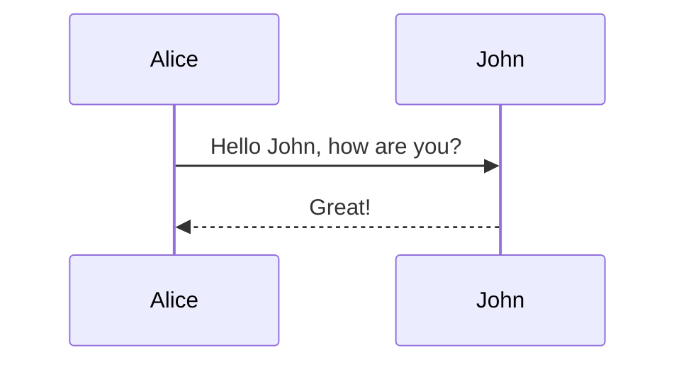

# bytemd [](https://npm.im/bytemd)

## Images


## Math equation

$$
c = \pm\sqrt{a^2 + b^2}
$$

## Mermaid



## Code syntax highlight

```js
import { Editor, Viewer } from 'bytemd';

// Editor
new Editor({
  target: document.body,
  props: {},
});

// Viewer
new Viewer({
  target: document.body,
  props: {},
});
```
