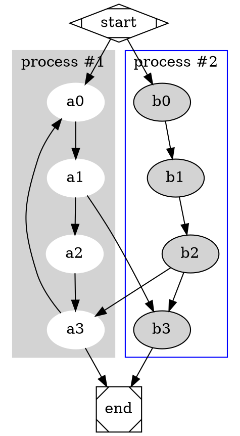

# bytemd [](https://npm.im/bytemd)

## Math equation

$$
c = \pm\sqrt{a^2 + b^2}
$$

## Mermaid


## Graphviz



## Code syntax highlight

```js
import { Editor, Viewer } from 'bytemd';

// Editor
new Editor({
  target: document.body,
  props: {},
});

// Viewer
new Viewer({
  target: document.body,
  props: {},
});
```

## Video Player

<video src="https://raw.githubusercontent.com/bower-media-samples/big-buck-bunny-1080p-30s/master/video.mp4" poster="https://raw.githubusercontent.com/bower-media-samples/big-buck-bunny-1080p-30s/master/poster.jpg"></video>

## ABC notation

```abc
X:1
T:The Legacy Jig
M:6/8
L:1/8
R:jig
K:G
GFG BAB | gfg gab | GFG BAB | d2A AFD |
GFG BAB | gfg gab | age edB |1 dBA AFD :|2 dBA ABd |:
efe edB | dBA ABd | efe edB | gdB ABd |
efe edB | d2d def | gfe edB |1 dBA ABd :|2 dBA AFD |]
```
