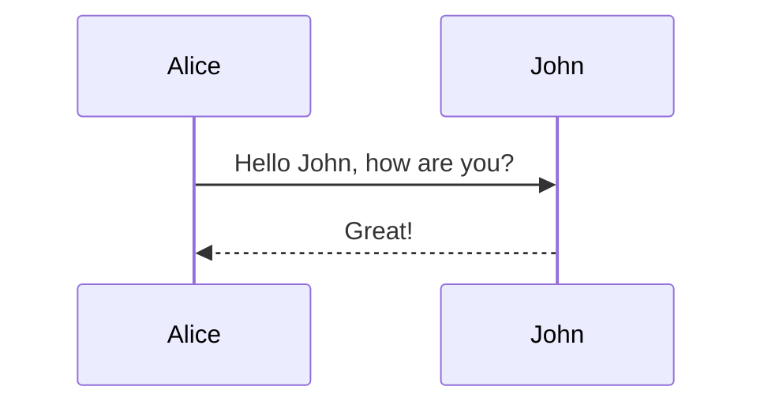

# @bytemd/plugin-mermaid

[](https://npm.im/@bytemd/plugin-mermaid)

[bytemd](https://github.com/bytedance/bytemd) plugin to support [mermaid](https://mermaid-js.github.io/mermaid/) diagram and flowchart

## Usage

```js
import { Editor } from 'bytemd';
import mermaid from '@bytemd/plugin-mermaid';

new Editor({
  target: document.body,
  props: {
    plugins: [
      mermaid(),
      // ... other plugins
    ],
  },
});
```

## Example

````md

````

## License

MIT
